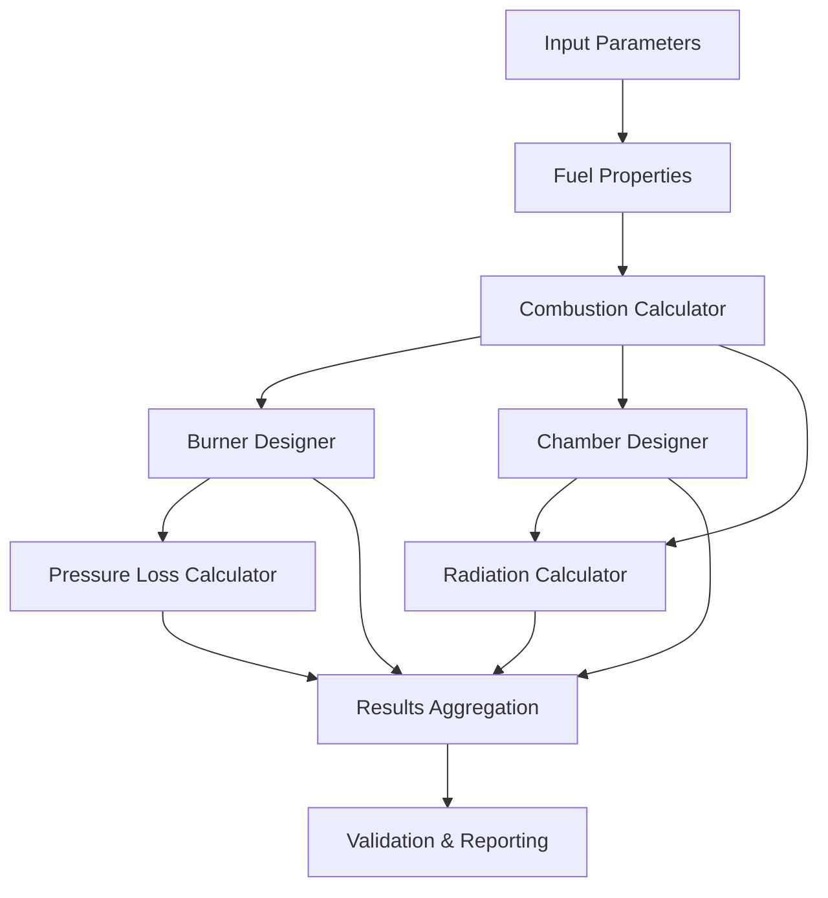

# Software Architecture and Design Patterns

## Table of Contents
1. [Architecture Overview](#architecture-overview)
2. [System Design Principles](#system-design-principles)
3. [Module Architecture](#module-architecture)
4. [Design Patterns Used](#design-patterns-used)
5. [Data Flow Architecture](#data-flow-architecture)
6. [GUI Architecture](#gui-architecture)
7. [Extensibility and Modularity](#extensibility-and-modularity)
8. [Performance Considerations](#performance-considerations)

## Architecture Overview

### High-Level Architecture

The Gas Burner Calculator follows a **layered architecture** pattern with clear separation of concerns:

```
┌─────────────────────────────────────────────┐
│              Presentation Layer             │
│                 (GUI/CLI)                   │
├─────────────────────────────────────────────┤
│              Application Layer              │
│            (Orchestration Logic)            │
├─────────────────────────────────────────────┤
│               Business Layer                │
│          (Calculation Modules)              │
├─────────────────────────────────────────────┤
│               Data Layer                    │
│         (File I/O, Configuration)          │
└─────────────────────────────────────────────┘
```

### System Components

#### Core Calculation Engine
- **Combustion Module**: Stoichiometric calculations and flame analysis
- **Burner Design Module**: Dimensional sizing and flow calculations
- **Chamber Design Module**: Volume and thermal calculations
- **Radiation Module**: Heat transfer by radiation
- **Pressure Loss Module**: Hydraulic calculations

#### Supporting Systems
- **Visualization Engine**: Chart generation and plotting
- **Report Generator**: Multi-format output creation
- **Data Management**: Configuration and result handling
- **GUI Framework**: User interface and interaction

### Architectural Principles

#### 1. Separation of Concerns
Each module handles a specific aspect of burner design:
- Combustion calculations are isolated from GUI logic
- Data persistence is separate from business logic
- Visualization is decoupled from calculations

#### 2. Modularity
- Each calculation module can operate independently
- Modules can be imported and used programmatically
- Clear interfaces between components

#### 3. Extensibility
- New fuel types can be added via data files
- Additional calculation methods can be integrated
- GUI can be extended with new tabs and features

#### 4. Testability
- Each module has comprehensive unit tests
- Integration tests verify module interactions
- Mock objects facilitate isolated testing

## System Design Principles

### SOLID Principles Implementation

#### Single Responsibility Principle (SRP)
```python
# Each class has a single, well-defined responsibility
class CombustionCalculator:
    """Handles only combustion-related calculations"""
    
class BurnerDesigner:
    """Responsible only for burner sizing"""
    
class RadiationCalculator:
    """Handles only radiation heat transfer"""
```

#### Open/Closed Principle (OCP)
```python
# Base class open for extension, closed for modification
class BaseCalculator:
    def calculate(self, inputs):
        raise NotImplementedError
        
class CombustionCalculator(BaseCalculator):
    def calculate(self, inputs):
        # Specific implementation
        pass
```

#### Liskov Substitution Principle (LSP)
```python
# All calculator classes can be used interchangeably
def run_calculation(calculator: BaseCalculator, inputs):
    return calculator.calculate(inputs)
```

#### Interface Segregation Principle (ISP)
```python
# Interfaces are specific to client needs
class Calculable:
    def calculate(self, inputs):
        pass
        
class Validatable:
    def validate(self, results):
        pass
        
class Reportable:
    def generate_report(self, data):
        pass
```

#### Dependency Inversion Principle (DIP)
```python
# High-level modules depend on abstractions
class BurnerDesigner:
    def __init__(self, combustion_calculator: CombustionCalculator):
        self.combustion_calc = combustion_calculator
```

### Design Patterns Used

#### 1. Strategy Pattern
Used for different calculation methods and fuel types:

```python
class FuelStrategy:
    def calculate_properties(self, conditions):
        raise NotImplementedError

class NaturalGasStrategy(FuelStrategy):
    def calculate_properties(self, conditions):
        # Natural gas specific calculations
        pass

class PropaneStrategy(FuelStrategy):
    def calculate_properties(self, conditions):
        # Propane specific calculations
        pass
```

#### 2. Factory Pattern
For creating appropriate calculators:

```python
class CalculatorFactory:
    @staticmethod
    def create_calculator(calc_type: str):
        if calc_type == "combustion":
            return CombustionCalculator()
        elif calc_type == "burner":
            return BurnerDesigner()
        elif calc_type == "radiation":
            return RadiationCalculator()
        else:
            raise ValueError(f"Unknown calculator type: {calc_type}")
```

#### 3. Observer Pattern
For GUI updates and progress reporting:

```python
class CalculationObserver:
    def update(self, stage: str, progress: float, results: dict):
        raise NotImplementedError

class GUIProgressObserver(CalculationObserver):
    def update(self, stage: str, progress: float, results: dict):
        # Update GUI progress bar and display
        self.update_progress_bar(progress)
        self.display_intermediate_results(results)
```

#### 4. Command Pattern
For undo/redo functionality in GUI:

```python
class Command:
    def execute(self):
        raise NotImplementedError
        
    def undo(self):
        raise NotImplementedError

class CalculateCommand(Command):
    def __init__(self, calculator, parameters):
        self.calculator = calculator
        self.parameters = parameters
        self.previous_results = None
        
    def execute(self):
        self.previous_results = self.calculator.get_current_results()
        return self.calculator.calculate(self.parameters)
        
    def undo(self):
        self.calculator.set_results(self.previous_results)
```

#### 5. Template Method Pattern
For calculation workflows:

```python
class CalculationTemplate:
    def calculate(self, inputs):
        self.validate_inputs(inputs)
        preprocessed = self.preprocess_inputs(inputs)
        results = self.perform_calculation(preprocessed)
        validated_results = self.validate_results(results)
        return self.postprocess_results(validated_results)
        
    def validate_inputs(self, inputs):
        # Default validation
        pass
        
    def perform_calculation(self, inputs):
        raise NotImplementedError
        
    def validate_results(self, results):
        # Default result validation
        return results
```

## Module Architecture

### Core Calculation Modules

#### Combustion Module (`src/combustion.py`)
```
CombustionCalculator
├── __init__(fuel_data_path)
├── calculate_stoichiometric_air()
├── calculate_combustion_products()
├── _calculate_adiabatic_temperature()
├── _calculate_flue_gas_composition()
└── get_fuel_properties()

CombustionResults (DataClass)
├── fuel_flow_rate
├── air_flow_rate
├── flue_gas_flow_rate
├── adiabatic_flame_temperature
├── heat_release_rate
├── excess_air_ratio
├── co2_volume_percent
└── o2_volume_percent
```

#### Burner Design Module (`src/burner_design.py`)
```
BurnerDesigner
├── __init__(combustion_calculator, safety_factor)
├── design_burner()
├── _calculate_gas_density()
├── _calculate_optimal_velocity()
├── _calculate_burner_pressure_drop()
├── _calculate_flame_length()
├── validate_design()
└── get_design_recommendations()

BurnerDesignResults (DataClass)
├── burner_diameter
├── burner_area
├── gas_velocity
├── burner_pressure_drop
├── required_supply_pressure
├── heat_release_density
├── burner_length
└── flame_length
```

#### Chamber Design Module (`src/chamber_design.py`)
```
ChamberDesigner
├── __init__(combustion_calculator, burner_designer)
├── design_chamber()
├── _calculate_flue_gas_volume_flow()
├── _calculate_chamber_dimensions()
├── _calculate_heat_transfer_coefficient()
├── _calculate_wall_temperature()
├── _calculate_chamber_surface_area()
├── _calculate_heat_loss()
├── calculate_temperature_distribution()
├── validate_design()
└── get_design_recommendations()
```

### Data Layer Architecture

#### Data Models
```python
@dataclass
class FuelProperties:
    name: str
    lower_heating_value_mass: float
    molecular_weight: float
    density: float
    air_fuel_ratio_mass: float

@dataclass
class PipeSegment:
    length: float
    diameter: float
    roughness: float
    material: str
    elevation_change: float = 0.0

@dataclass
class CalculationMetadata:
    calculation_id: str
    timestamp: str
    software_version: str
    user_name: Optional[str] = None
    project_name: Optional[str] = None
```

#### Data Access Layer
```python
class DataManager:
    def __init__(self, data_directory: str):
        self.data_directory = data_directory
        
    def load_fuel_data(self) -> Dict:
        """Load fuel properties from JSON"""
        
    def save_calculation_results(self, results: Dict, filename: str):
        """Save results to file"""
        
    def load_calculation_setup(self, filename: str) -> Dict:
        """Load calculation parameters"""
```

## Data Flow Architecture

### Calculation Pipeline

```
Input Parameters
       ↓
   Validation
       ↓
Fuel Properties Loading
       ↓
Combustion Calculations
       ↓
Burner Design Calculations
       ↓
Chamber Design Calculations
       ↓
Radiation Calculations
       ↓
Pressure Loss Calculations
       ↓
Results Validation
       ↓
Output Generation
```

### Data Dependencies



### Information Flow Patterns

#### Forward Dependencies
- Combustion results feed into burner design
- Burner design influences chamber design
- All calculations contribute to final reporting

#### Feedback Loops
- Design validation may trigger parameter adjustments
- Optimization routines iterate until convergence
- GUI updates trigger recalculations

## GUI Architecture

### Model-View-Controller (MVC) Pattern

#### Model Layer
```python
class CalculationModel:
    def __init__(self):
        self.parameters = {}
        self.results = {}
        self.observers = []
        
    def update_parameters(self, new_params):
        self.parameters.update(new_params)
        self.notify_observers()
        
    def get_results(self):
        return self.results
        
    def calculate(self):
        # Perform calculations
        self.notify_observers()
```

#### View Layer
```python
class MainWindow(tk.Tk):
    def __init__(self, controller):
        super().__init__()
        self.controller = controller
        self.setup_ui()
        
    def setup_ui(self):
        # Create tabs and widgets
        self.create_input_tab()
        self.create_results_tab()
        
    def update_display(self, results):
        # Update GUI with new results
        pass
```

#### Controller Layer
```python
class ApplicationController:
    def __init__(self):
        self.model = CalculationModel()
        self.view = MainWindow(self)
        
    def handle_calculate_request(self, parameters):
        self.model.update_parameters(parameters)
        results = self.model.calculate()
        self.view.update_display(results)
```

### GUI Component Architecture

#### Tab-Based Interface
```
MainWindow
├── InputParametersTab
│   ├── FuelSelectionFrame
│   ├── PowerSettingsFrame
│   ├── PressureSettingsFrame
│   └── GeometryFrame
├── CombustionAnalysisTab
│   ├── StoichiometricFrame
│   ├── FlamePropertiesFrame
│   └── EmissionsFrame
├── BurnerDesignTab
│   ├── DimensionalFrame
│   ├── FlowAnalysisFrame
│   └── ValidationFrame
├── ChamberDesignTab
│   ├── VolumeCalculationsFrame
│   ├── HeatTransferFrame
│   └── PerformanceFrame
├── PressureAnalysisTab
│   ├── SystemComponentsFrame
│   ├── LossCalculationsFrame
│   └── OptimizationFrame
└── ResultsSummaryTab
    ├── OverviewFrame
    ├── ValidationFrame
    └── ExportFrame
```

### Event-Driven Architecture

#### Event Types
```python
class CalculationEvent:
    PARAMETER_CHANGED = "parameter_changed"
    CALCULATION_STARTED = "calculation_started"
    CALCULATION_COMPLETED = "calculation_completed"
    VALIDATION_FAILED = "validation_failed"
    EXPORT_REQUESTED = "export_requested"
```

#### Event Handling
```python
class EventBus:
    def __init__(self):
        self.listeners = defaultdict(list)
        
    def subscribe(self, event_type: str, handler):
        self.listeners[event_type].append(handler)
        
    def publish(self, event_type: str, data):
        for handler in self.listeners[event_type]:
            handler(data)
```

## Extensibility and Modularity

### Plugin Architecture

#### Plugin Interface
```python
class CalculationPlugin:
    def get_name(self) -> str:
        raise NotImplementedError
        
    def get_version(self) -> str:
        raise NotImplementedError
        
    def calculate(self, inputs: Dict) -> Dict:
        raise NotImplementedError
        
    def validate_inputs(self, inputs: Dict) -> List[str]:
        raise NotImplementedError
```

#### Plugin Manager
```python
class PluginManager:
    def __init__(self):
        self.plugins = {}
        
    def load_plugin(self, plugin_path: str):
        # Dynamically load plugin
        plugin = importlib.import_module(plugin_path)
        self.plugins[plugin.get_name()] = plugin
        
    def get_available_plugins(self) -> List[str]:
        return list(self.plugins.keys())
        
    def execute_plugin(self, name: str, inputs: Dict) -> Dict:
        return self.plugins[name].calculate(inputs)
```

### Configuration System

#### Configuration Manager
```python
class ConfigurationManager:
    def __init__(self, config_file: str = "config.json"):
        self.config_file = config_file
        self.config = self.load_configuration()
        
    def load_configuration(self) -> Dict:
        try:
            with open(self.config_file, 'r') as f:
                return json.load(f)
        except FileNotFoundError:
            return self.get_default_configuration()
            
    def get_default_configuration(self) -> Dict:
        return {
            "output_directory": "output",
            "default_fuel": "natural_gas",
            "gui_theme": "default",
            "safety_factors": {
                "pressure": 1.3,
                "thermal": 1.2
            }
        }
```

### Extension Points

#### Custom Fuel Types
```python
def register_custom_fuel(name: str, properties: Dict):
    """Register a new fuel type with the system"""
    fuel_registry = FuelRegistry.get_instance()
    fuel_registry.add_fuel(name, properties)
    
# Usage
register_custom_fuel("biogas", {
    "lower_heating_value_mass": 22000000,  # J/kg
    "molecular_weight": 24.5,  # kg/kmol
    "density": 1.1,  # kg/m³
    "air_fuel_ratio_mass": 9.5
})
```

#### Custom Calculation Methods
```python
class CustomCombustionMethod(CombustionCalculator):
    def _calculate_adiabatic_temperature(self, fuel_type: str, excess_air: float):
        # Custom implementation with enhanced accuracy
        return super()._calculate_adiabatic_temperature(fuel_type, excess_air)
```

## Performance Considerations

### Computational Optimization

#### Caching Strategy
```python
from functools import lru_cache

class OptimizedCalculator:
    @lru_cache(maxsize=128)
    def calculate_fuel_properties(self, fuel_type: str, temperature: float):
        # Expensive calculation cached for reuse
        return self._compute_properties(fuel_type, temperature)
```

#### Lazy Loading
```python
class LazyDataLoader:
    def __init__(self):
        self._fuel_data = None
        
    @property
    def fuel_data(self):
        if self._fuel_data is None:
            self._fuel_data = self._load_fuel_data()
        return self._fuel_data
```

#### Vectorized Calculations
```python
import numpy as np

def calculate_temperature_profile(positions: np.ndarray, 
                                initial_temp: float,
                                decay_constant: float) -> np.ndarray:
    """Vectorized temperature calculation for better performance"""
    return initial_temp * np.exp(-decay_constant * positions)
```

### Memory Management

#### Object Pooling
```python
class ResultsPool:
    def __init__(self, pool_size: int = 10):
        self.pool = [CombustionResults() for _ in range(pool_size)]
        self.available = list(range(pool_size))
        
    def get_results_object(self):
        if self.available:
            return self.pool[self.available.pop()]
        return CombustionResults()  # Create new if pool empty
        
    def return_results_object(self, obj):
        # Reset object and return to pool
        obj.reset()
        self.available.append(self.pool.index(obj))
```

### Asynchronous Processing

#### Background Calculations
```python
import asyncio
from concurrent.futures import ThreadPoolExecutor

class AsyncCalculationManager:
    def __init__(self):
        self.executor = ThreadPoolExecutor(max_workers=4)
        
    async def calculate_async(self, calculation_func, *args, **kwargs):
        loop = asyncio.get_event_loop()
        result = await loop.run_in_executor(
            self.executor, calculation_func, *args, **kwargs
        )
        return result
        
    async def batch_calculate(self, calculations: List[Tuple]):
        tasks = [
            self.calculate_async(calc_func, *args, **kwargs)
            for calc_func, args, kwargs in calculations
        ]
        return await asyncio.gather(*tasks)
```

### Scalability Considerations

#### Distributed Computing
```python
from multiprocessing import Pool
import dask.array as da

class DistributedCalculator:
    def __init__(self, n_processes: int = None):
        self.n_processes = n_processes or os.cpu_count()
        
    def parallel_calculate(self, parameter_sets: List[Dict]):
        with Pool(self.n_processes) as pool:
            results = pool.map(self.single_calculation, parameter_sets)
        return results
        
    def single_calculation(self, parameters: Dict):
        # Perform single calculation
        calculator = CombustionCalculator()
        return calculator.calculate_combustion_products(**parameters)
```

---

*This architecture documentation provides a comprehensive overview of the system design. For implementation details, refer to the source code and API documentation.*